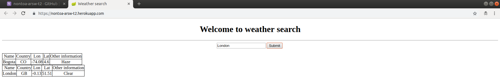

# NONTOA-ARSW-T2

>Para clonar el archivo 

git clone https://github.com/nontoa/NONTOA-ARSW-T2
>

### Funcionalidad:

#### Para mostrar la información referente a un país, debera digitar el nombre del país y dar click en el boton.

## Autor

* **Juan Nicolas Nontoa Caballero**  NONTOA-ARSW-T2 - [nontoa] (https://github.com/nontoa)

## licencia

Este proyecto está licenciado bajo la Licencia MIT - vea el archivo [LICENSE](LICENSE) para más detalles.

## Heroku

El link de despliegue en Heroku es (https://nontoa-arsw-t2.herokuapp.com/)
